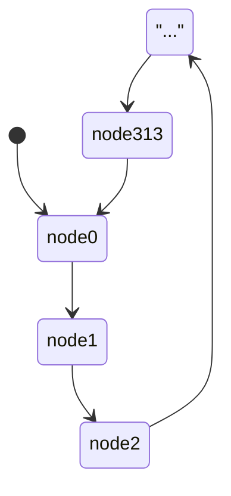

今年的 AIS3 前測又輪到我出逆向毒害大家，這次每個題種其實都有一題考古題，整體難度也有下修，意思就是解法很多種，沒有全部擋起來，是個主辦那邊希望大家都能學到東西的概念，所以這篇 writeup 的字數可能也會很多，希望沒解開的、或是完全不知道要幹嘛的人都能看懂。

然後 source code 在這裡 [github](https://github.com/terrynini/MyCTFChallenges)

總之這裡是我預設的解法, gogo：

---

# 🍍 TsaiBro (考古題)

## 題目敘述

> 很好....你很腦殘嗎....敢這樣講刀劍神域.......我死也不會放過你 我..要..殺死...你..
> <Image src="./kirito.gif" alt="" />

## 題解
這題之前在 BambooFox 邀講的社課上也有提到過，是個可以不用逆向也能夠解開的題目，跟去年前測是同一題，連名字也沒換 誒嘿([傳送門](http://blog.terrynini.tw/tw/2019-AIS3-%E5%89%8D%E6%B8%AC%E5%AE%98%E6%96%B9%E8%A7%A3/#TsaiBro))，差別只有使用的 table 不同，題目實作了自己的 [Tap code](https://en.wikipedia.org/wiki/Tap_code)，透過 8*8 的 table 來 encode 輸入：

|    | $1$ | $2$ | $3$ | $4$ | $5$ | $6$ | $7$ | $8$ |
|:---:|:---:|:---:|:---:|:---:|:---:|:---:|:---:|:---:|
|  $1$ | 5 | 6 | 7 | 8 | 9 | \{ | } | _ |
|  $2$ | W | X | Y | 0 | y | z | A | B |
|  $3$ | a | b | c | d | m | n | o | p |
|  $4$ | S | T | U | V | G | H | I | J |
|  $5$ | K | L | M | N | u | v | w | x |
|  $6$ | e | f | g | h | q | r | s | t |
|  $7$ | i | j | k | l | O | P | Q | R |
|  $8$ | C | D | E | F | 1 | 2 | 3 | 4 |

舉例，`Ｗ` 這個字會被轉換成 `. ..`，以此類推。
這個 table 可以透過黑箱測試推理、`strings`、或是逆向找到，這裡用 radare2 看一下可以找到 table 在 `0x201020`：

<Image src="./r2_tsai.png" alt="" />

寫個 script 把 `TsaiBroSaid` 解回來就好了。

```python solve.py
#!/usr/bin/env python3
table = ['5','6','7','8','9','{','}','_',
'W','X','Y','0','y','z','A','B',
'a','b','c','d','m','n','o','p',
'S','T','U','V','G','H','I','J',
'K','L','M','N','u','v','w','x',
'e','f','g','h','q','r','s','t',
'i','j','k','l','O','P','Q','R',
'C','D','E','F','1','2','3','4']

f = open("./TsaiBroSaid","r").read().split('\n')[1]
f = f.split("發財")[1:]
for i in range(0,len(f),2):
    print(table[(len(f[i])-1)*8+len(f[i+1])-1],end='')
```

> Flag: `AIS3{y3s_y0u_h4ve_s4w_7h1s_ch4ll3ng3_bef0r3_bu7_its_m0r3_looooooooooooooooooong_7h1s_t1m3}`

吐槽一下 more long 是什麼爛英文

---

# 🎹 Fallen Beat

## 題目敘述

> CTF player,
> 我要挑戰你, I'm gonna challenge you!!
> [ZR](https://www.youtube.com/channel/UC5wFI66lU6oqZf-lXiX1lwQ)
> 這是我的室友兼 lab 同學,
> 他已經考過金框暴龍天，他是個旋鈕人,
> 不像你是個敲鍵盤的,
> 所以我要測測你的程度到哪裡,
> 就用 ZR 的大一 project 來決勝負吧！！
> 得到 Full Combo 來讓我刮目相看！！

來自室友大一的 final project，音樂音量沒有 normalize 導致我已經耳聾，題目說只要 full combo 就會給你 flag，避免有人妄想用玩的，所以跟普通音遊規則不同，調整成只有 perfect 才會 combo，如果你還玩出來了，麻煩下面留言，我要跪你。

## 題解

java 是直譯式語言， compile 只是 compile 成 Java bytecode，幾乎所有的東西都還留著，包括變數名稱，decompile 後可以拿到幾乎跟原始碼一樣的 java code，直接用[線上工具](http://www.javadecompilers.com/)來 decompile，這題難的地方大概只有 code 滿多的，可以直接找一下變數名稱有沒有 flag：

<Image src="./decompile.png" alt="" />

在 `Visual/PanelEnding.java` 79 行附近可以找到一個變數叫做 flag ，內容看起來像是被加密過。

```java Visual/PanelEnding.java=79
        this.lWest = new JLabel();
        this.lEast = new JLabel();
        this.flag = new byte[] { 89, 74, 75, 43, 126, 69, 120, 109, 68, 109, 109, 97, 73, 110, 45, 113, 102, 64, 121, 47, 111, 119, 111, 71, 114, 125, 68, 105, 127, 124, 94, 103, 46, 107, 97, 104 };        this.btnFont = new Font("Dialog", 1, 35);
        this.btnBack = new JButton("Back");
        this.setLayout(new BorderLayout());
        this.setBackground(this.c.brown);
```

繼續往下看，在 `setValue` 中看得出來當 `t == mc` 的時候，`cache` 會拿來跟 `flag` decrypt 然後印出來：

```java Visual/PanelEnding.java=173
        if (t == mc) {
            for (int i = 0; i < cache.size(); ++i) {
                final byte[] flag = this.flag;
                final int n = i % this.flag.length;
                flag[n] ^= (byte)(Object)cache.get(i);
            }
            final String fff = new String(this.flag);
            this.text[0].setText(String.format("Flag: %s", fff));
        }
```

然後追一下 `t`、`mc`、`cache` 分別是什麼，在 `Control/GameControl.java` 中可以找到 `t` 就是這個譜面總共有多少的音符， `mc` 就是遊戲結束時的 combo 數：

```java Control/GameControl.java=291
this.pe.setValue(this.total, this.critical, this.early, this.late, this.miss, this.comboMax, this.info, this.cache);
```

繼續往下追可以找到 cache 其實就是讀進來的譜面檔案

```java Control/GameControl.java=143
            while (br.ready()) {
                final String s = br.readLine();
                if (s.charAt(0) != '*') {
                    final int a = Integer.parseInt(s);
                    this.cache.add(a);
                    for (int k = 0; k < 5; ++k) {
                        if ((a >> k & 0x1) == 0x1) {
                            if (k != 4) {
                                (this.note = new JLabel(this.bt)).setBounds(bounds[k], this.y, 100, 40);
                            }
                            else {
                                (this.note = new JLabel(this.fx)).setBounds(bounds[k], this.y, 350, 40);
                            }
                            this.pFumen.add(this.note);
                            this.check.get(k).add(this.y);
                            ++this.total;
                        }
                    }
                    this.y += this.distance;
                }
            }
```

看到這裡基本上可以想到幾個解法：

- 改 `if(t == mc)` 的 bytecode 讓他直接通過
- 找到 `cache`，模仿 code 自己 decrypt
- 改 source code 然後重新編譯
- 遊戲修改器
- ...

因為沒做什麼奇怪的事情，所以上面的解法應該都是做得到的，不過還是最推薦第二個做法，因為我 Mac 也會跑版，所以還是寫腳本解實在，當然你要直接抽 code 出來寫一個 java 也行：

```python solve.py
#!/usr/bin/env python3
flag = [89, 74, 75, 43, 126, 69, 120, 109, 68, 109, 109, 97, 73, 110, 45, 113, 102, 64, 121, 47, 111, 119, 111, 71, 114, 125, 68, 105, 127, 124, 94, 103, 46, 107, 97, 104]

with open('AIS3_2020_pre/Fallen_Beat/songs/gekkou/hell.txt') as f:
    lines = filter(lambda l: '*' not in l, f.readlines()[1:])

for idx,line in enumerate(lines):
        flag[idx%len(flag)] ^= int(line)

print(bytes(flag))
```

> Flag: `AIS3{Wow_how_m4ny_h4nds_do_you_h4ve}`

---

# 🧠 Stand up!Brain

## 題目敘述

> 又到了 Brain tell 咪 ㄜ joke 的時間了
> 這次輪到你說個笑話來聽聽了
> <Image src="./joke.webp" alt="" />

## 題解

題目給的是一個用 Ｃ 寫的 [Brainfuck](https://zh.wikipedia.org/wiki/Brainfuck) interpreter，老梗，但不知道也沒關係，還是可以透過逆向看懂。

這裡用 radare2 disassemble，`0x7e2` 這裡可以看到輸入是 6 個字，推測輸入正確的 6 個字就會拿到 flag：

```x86asm scanf
lea rax, [var_eh]
mov rsi, rax
; const char *format
; "%6s"
lea rdi, [0x00000a84]
mov eax, 0
; int scanf(const char *format)
call sym.imp.__isoc99_scanf;[oc]
mov dword [var_24h], 0
jmp 0x853
```

可以嘗試暴搜正確的 6 個字是什麼，但滿久的，繼續往下看，`0x853` 跟 `0x81c` 這裡是一個 for 迴圈，每個迴圈做的事情是把 input 拿出來放到 `0x00201380` 的 array 上並且再補上一個元素 `1`，所以 array `0x00201380` 最後會變成 `[input[0], 1, input[1], 1, input[2], 1, input[3], 1, input[4], 1, input[5], 1]`：

```x86asm for_loop
[0x81c]
CODE XREF from main @ 0x857
mov eax, dword [var_24h]
lea edx, [rax + rax]
mov eax, dword [var_24h]
cdqe
movzx ecx, byte [rbp + rax - 0xe] ; get char at input[ecx]
movsxd rdx, edx
lea rax, [0x00201380]
mov byte [rdx + rax], cl
mov eax, dword [var_24h]
add eax, eax
add eax, 1
movsxd rdx, eax
lea rax, [0x00201380]
mov byte [rdx + rax], 1
add dword [var_24h], 1
```

再往下看，會看到引用一串 data，這一串就是 Brainfuck 程式碼：

```brainfuck
-------------------------------------------------------------------[>[-]<[-]]>[>--------------------------------------------------------[>[-]<[-]]>[>-------------------------------------------------------[>[-]<[-]]>[>------------------------------------------------------[>[-]<[-]]>[>---------------------------------------------------[>[-]<[-]]>[>---------------------------------[>[-]<[-]]>[>>----[---->+<]>++.++++++++.++++++++++.>-[----->+<]>.+[--->++<]>+++.>-[--->+<]>-.[---->+++++<]>-.[-->+<]>---.[--->++<]>---.++[->+++<]>.+[-->+<]>+.[--->++<]>---.++[->+++<]>.+++.[--->+<]>----.[-->+<]>-----.[->++<]>+.-[---->+++<]>.--------.>-[--->+<]>.-[----->+<]>-.++++++++.--[----->+++<]>.+++.[--->+<]>-.-[-->+<]>---.++[--->+++++<]>.++++++++++++++.+++[->+++++<]>.[----->+<]>++.>-[----->+<]>.---[->++<]>-.++++++.[--->+<]>+++.+++.[-]]]]]]]

```

如果不知道 Brainfuck 還是能透過逆向知道這個語言的大概，程式在 `0x986` 的地方進入一個很大的 for loop，`0x869` 這裏開始是 switch 的範圍檢查，然後往下一點 `0x87f` 這裡是 switch 決定去哪個 case，這裡的 radare2 下的註解是錯的，因為最小的 case `+(0x2b)` 到最大的 case `](0x5d)` 閉區間長度是 51，但其實只有 7 個 case：

```x86asm switch
0x87f [oi]
mov eax, eax
lea rdx, [rax*4]
lea rax, [0x00000a9c]
mov eax, dword [rdx + rax]
movsxd rdx, eax
lea rax, [0x00000a9c]
add rax, rdx
; switch table (51 cases) at 0xa9c
;-- switch
jmp rax
```

這幾個 case 是 `+`、`-`、`<`、`>`、`[`、`]`、`.`，看一下就可以知道每個符號的意義了，打下去太多，略一波[wiki](https://zh.wikipedia.org/wiki/Brainfuck)。
所以現在可以回頭看那一串 Brainfuck 在幹嘛了，基本上 `-------------------------------------------------------------------[>[-]<[-]]>[..略..]` 其實就是 `if` ，所以全部的 code 就是巢狀的 `if`，拿個簡略的狀況說明，下面這段 code 的邏輯是 `if(var0==1){..略..}`：

```brainfuck
# 假設記憶體長這樣 memory[4,1]
--[>[-]<[-]]>[..略..]
```

一開始 `--` 會把記憶體上的 `memory[0]` 扣 2 變成 2，執行到`[`時如果當前指標指到的記憶體位置不是`0`就會進入`[>[-]<[-]]`，`[>[-]<[-]]`做的事情是把下一個位置（`memory[1]`）扣成 0 然後再把指標移回來`memory[0]`，清空 `memory[0]`，所以當執行到 `>[...略...]` 時，第一個`>`移動指標到`memory[1]`，是 0就不會去執行 `[...略...]`，那如果重新來過，記憶體上的 4 一開始是 2 的話：

```brainfuck
# 假設記憶體長這樣 memory[2,1]
--[>[-]<[-]]>[..略..]
```

一開始 `--` 會把記憶體上的 `memory[0]` 扣 2 變成 0，執行到`[`時因為現在指向的記憶體數值是 0 所以不會進入`[>[-]<[-]]`，跳到後面執行`>[...略...]`，第一個`>`移動指標到`memory[1]`，是 1，就會執行`[...略...]`。

到這裡就很清楚了，輸入的 ascii code 要等於前面有幾個`-`，這樣才會通過判定，可以知道正確的輸入是`[67, 56, 55, 54, 51, 33]`就是`C8763!`，把邏輯換成 C 會像是這樣：

```c pseudo_code=
if(input[0] == 'C'){
    if(input[1] == '8'){
        if(input[2] == '7'){
            if(input[3] == '6'){
                if(input[4] = '3'){
                    if(input[5] = '!'){
                        print flag
                    }
                }
            }
        }
    }
}
```

當然也可以直接跳過所有的`if`，只執行最後印 flag 的 code 就好了，可以用[線上工具](https://www.tutorialspoint.com/execute_brainfk_online.php)。

```brainfuck print_flag
>>----[---->+<]>++.++++++++.++++++++++.>-[----->+<]>.+[--->++<]>+++.>-[--->+<]>-.[---->+++++<]>-.[-->+<]>---.[--->++<]>---.++[->+++<]>.+[-->+<]>+.[--->++<]>---.++[->+++<]>.+++.[--->+<]>----.[-->+<]>-----.[->++<]>+.-[---->+++<]>.--------.>-[--->+<]>.-[----->+<]>-.++++++++.--[----->+++<]>.+++.[--->+<]>-.-[-->+<]>---.++[--->+++++<]>.++++++++++++++.+++[->+++++<]>.[----->+<]>++.>-[----->+<]>.---[->++<]>-.++++++.[--->+<]>+++.+++.
```

> Flag: `AIS3{Th1s_1s_br4iNFUCK_bu7_m0r3_ez}`

---

# 🍹 Long Island Iced Tea

## 題目敘述

> 長·島·冰·茶
> 我·的·最·愛
> 長·島·冰·茶
> 超·爽·口·感
> 咚咚咚ㄎㄧㄤ
> 咚咚咚ㄎㄧㄤ
> 咚咚咚ㄎㄧㄤ
> 我真的好ㄎㄧㄤ

<iframe src="http://player.bilibili.com/player.html?aid=703074&bvid=BV1Bs411f7DA&cid=1031101&page=1"></iframe>

附這個連結害我寫這篇的時候一直重播

## 題解

這裡就用 decompile 之後的 code 來講解，沒有 IDA 可以用 [Ghidra](https://ghidra-sre.org/)，科普一下，Ghidra 唸作[Gee-druh](https://github.com/NationalSecurityAgency/ghidra/wiki/Frequently-asked-questions#how-do-you-pronounce-ghidra)，或是你可以學我念 Costco。

基本上 main 做的事情就是 [Zero padding](https://en.wikipedia.org/wiki/Padding_(cryptography)#Zero_padding)

```c main=
puts("My encryptor 0.1");
puts("I didn't implement the decryptor");
puts("So,you'll never find out my secret unless I am drunk");
__isoc99_scanf("%ms", &s);
v7 = strlen(s);
//v8 算出比目前輸入長度大的 8 的倍數，例如 7 會得到 8，17 得到 24
v8 = 8 * (v7 / 8 + 1);
//重新分配一個大小，而且複製本來的輸入上去
s = (char *)realloc(s, v8 + 1);
//多出來的部分都放 0，其實就是在做 0 padding
for ( i = v8; i >= v7; --i )
  s[i] = 0;
qmemcpy(v10, "dloGtroBedaJybuR", 16);
for ( j = 0; j < v8 / 8 + 1; ++j )
  sub_83A(s, v10);
for ( k = 0; k < v8; ++k )
  printf("%02hhx", (unsigned int)s[k]);
free(s);
```

沒什麼特別的，可以繼續往下看：

```c sub_83A=
__int64 __fastcall sub_83A(unsigned int *a1, __int64 a2)
{
  __int64 result; // rax
  unsigned int i; // [rsp+1Ch] [rbp-14h]
  unsigned int v4; // [rsp+20h] [rbp-10h]
  unsigned int v5; // [rsp+24h] [rbp-Ch]
  unsigned int v6; // [rsp+28h] [rbp-8h]

  v4 = *a1;
  v5 = a1[1];
  v6 = 0;
  for ( i = 0; i <= 0x3F; ++i )
  {
    v4 += (((v5 >> 5) ^ (16 * v5)) + v5) ^ (*(_DWORD *)(4LL * (v6 & 3) + a2) + v6);
    v6 -= 0x61C88647;
    v5 += (((v4 >> 5) ^ (16 * v4)) + v4) ^ (*(_DWORD *)(4LL * ((v6 >> 11) & 3) + a2) + v6);
  }
  *a1 = v4;
  result = v5;
  a1[1] = v5;
  return result;
}
```

看起來是某種加密或是 hash 算法，如果夠敏感的話應該會注意到這個算法裡面有 magic number 存在，`0x61C88647`，但要注意，這是 IDA 照 variable type 修正產出的 pseudo code，回去看 assembly，會發現其實是：

```x86asm 
mov     [rbp+var_4], 9E3779B9h
```

本來是 `v6 += 0x9E3779B9`，但 IDA 覺得 `v6 -= 0x61C88647` 比較好，總之只是 2's complement，其實不管哪一個都可以找關鍵算法 [TEA](https://en.wikipedia.org/wiki/Tiny_Encryption_Algorithm)，仔細看一下會發現其實有點不太一樣，但應該足夠模仿寫出 decrypt 的程式了，就反轉操作而已，如果有耐心爬一下 wiki 會發現題目實作的算法是 [XTEA](https://en.wikipedia.org/wiki/XTEA)，直接用 wiki 上的 decrypt 就行了，要注意的是 main 裡面其實只有加密第一塊 block，所以第一塊被加密了 9 次，只要解密第一塊就好了：

```c main=
puts("My encryptor 0.1");
puts("I didn't implement the decryptor");
puts("So,you'll never find out my secret unless I am drunk");
__isoc99_scanf("%ms", &s);
v7 = strlen(s);
v8 = 8 * (v7 / 8 + 1);
s = (char *)realloc(s, v8 + 1);
for ( i = v8; i >= v7; --i )
  s[i] = 0;
qmemcpy(v10, "dloGtroBedaJybuR", 16);
//---------------這裡永遠只加密第一塊 block----------------
for ( j = 0; j < v8 / 8 + 1; ++j )
  sub_83A(s, v10);
//------------------------------------------------------
for ( k = 0; k < v8; ++k )
  printf("%02hhx", (unsigned int)s[k]);
free(s);
```

因為只有第一塊有加密：

```python
#My encryptor 0.1
#I didn't implement the decryptor
#So,you'll never find out my secret unless I am drunk
#850a2a4d3fac148269726c5f673176335f6d335f55725f49475f346e645f746831735f31735f6d316e655f746572727974657272795f5f7d0000000000000000
In [1]: bytes.fromhex("850a2a4d3fac148269726c5f673176335f6d335f55725f49475f346e645f746831735f31735f6d316e655f746572727974657272795f5f7d0000000000000000")
Out[1]: b'\x85\n*M?\xac\x14\x82irl_g1v3_m3_Ur_IG_4nd_th1s_1s_m1ne_terryterry__}\x00\x00\x00\x00\x00\x00\x00\x00'
```

所以這裡就有第二個解法是爆搜 3 byte 的文字(`8 - len('AIS3{')`)，賽中 @bronson113 跟我說他有非預期解，只要暴搜 2 byte，我還以為又寫爛 code ...，雖然是真的 code 寫爛才敢放這題，不然好像有點太難，不知道要查 magic number 的人應該解不出來，本來是想出那種加密寫錯的沒錯，但怎麼出好像都有點太難，之後才知道原來大家暴搜都有猜字 = =，好，恩，總之你猜到那個字是 girl 就可以只暴搜 2 byte，[聖結石保險起見買三件](https://youtu.be/mVN-kdWxmfs?t=39)，保險起見我都搜 3 byte。

```python bruteforce.py=
from subprocess import *
from string import *
from itertools import product

target = open("./flag",'rb').read()
for cipher in product(printable[:-5],repeat=3):
    plain = f"AIS3{{{''.join(cipher)}irl_g1v3_m3_Ur_IG_4nd_th1s_1s_m1ne_terryterry__}}".encode()
    p = check_output("./Long\ Island\ Iced\ Tea",input=plain,shell=True)
    if p == target:
        print(plain)
        break
```

不過最快的解法還是直接寫 decrypt：

```c decrypt.c=
#include <stdlib.h>
#include <stdio.h>

//copy from wiki
void decipher(uint32_t v[2], uint32_t const key[4]) {
    unsigned int i;
    uint32_t v0=v[0], v1=v[1], delta=0x9E3779B9, sum=delta*64;
    for (i=0; i < 64; i++) {
        v1 -= (((v0 << 4) ^ (v0 >> 5)) + v0) ^ (sum + key[(sum>>11) & 3]);
        sum -= delta;
        v0 -= (((v1 << 4) ^ (v1 >> 5)) + v1) ^ (sum + key[sum & 3]);
    }
    v[0]=v0; v[1]=v1;
}

int main(){
    char key[] = "dloGtroBedaJybuR";
    char input[] = {0x85,0x0a,0x2a,0x4d,0x3f,0xac,0x14,0x82,0};

    for(int r = 0; r < 9 ; r++){
        decipher(input,key);
    }

    printf("%sirl_g1v3_m3_Ur_IG_4nd_th1s_1s_m1ne_terryterry__}",input);
}
```

> Flag: `AIS3{A!girl_g1v3_m3_Ur_IG_4nd_th1s_1s_m1ne_terryterry__}`

> 補：看完 writeup，大概是一半的人用暴搜，一半的人有認出來是 XTEA，出的不錯？
> 打比賽的時候有遇過 rc4 位移故意寫錯要修，或土炮加密寫錯之類的題目，大概有個兩三題，但覺得出在這裡好像不太好
> 最後產了一題大便題🤔️

---

# 🌹 La vie en rose

## 題目敘述

> <Image src="./rose.jpg" alt="" />

## 題解

稍微逆向看一下會發現 binary 前面一直使用 `_MEIPASS2` 這個字串，會被拿去 call `GetEnvironmentVariableW` 之類的 API，查一下就可以發現這個是 PyInstaller 使用的一個環境變數，PyInstaller 是一個可以把 python 包成執行檔的工具（exe以外也可以），原理是把 python compile 成 bytecode 之後，執行檔執行時會把 bytecode 抓出來執行，不難想到應該會有工具可以把東西拉出來，[PyInstaller Extractor](https://sourceforge.net/projects/pyinstallerextractor/)。

所有的東西會被抽出來放進 `La vie en rose.exe_extracted` 資料夾，pyinstallerextractor.py 會告訴你 entry point 是啥：

```shell
pyinstxtractor.py:86: DeprecationWarning: the imp module is deprecated in favour of importlib; see the module's documentation for alternative uses
  import imp
[*] Processing La vie en rose.exe
[*] Pyinstaller version: 2.1+
[*] Python version: 38
[*] Length of package: 9518557 bytes
[*] Found 955 files in CArchive
[*] Beginning extraction...please standby
[+] Possible entry point: pyiboot01_bootstrap
[+] Possible entry point: pyi_rth__tkinter
[+] Possible entry point: pyi_rth_multiprocessing
[+] Possible entry point: rose
[*] Found 258 files in PYZ archive
[*] Successfully extracted pyinstaller archive: La vie en rose.exe
```

但如果它給錯，也可以用 grep 找到，因為 python bytecode 的字串是 raw data：

```shell
$ grep outland *
grep: PYZ-00.pyz_extracted: Is a directory
Binary file rose matches
```

所以我們接下來要做的事情是 decompile rose.pyc，這裡可以用 uncompyle6 來做，但是會有錯誤訊息，原因是 pyc 少了版本 magic number，很好理解，因為 PyInstaller 知道自己在這個 binary 用了什麼版本，所以他可以把 magic number 拔掉來節省空間：

```python
uncompyle6 rose.pyc
Traceback (most recent call last):
  File "/usr/local/lib/python3.7/site-packages/xdis/load.py", line 168, in load_module_from_file_object
    float_version = magic_int2float(magic_int)
  File "/usr/local/lib/python3.7/site-packages/xdis/magics.py", line 399, in magic_int2float
    return py_str2float(magicint2version[magic_int])
KeyError: 227

During handling of the above exception, another exception occurred:

Traceback (most recent call last):
  File "/usr/local/bin/uncompyle6", line 8, in <module>
    sys.exit(main_bin())
  File "/usr/local/lib/python3.7/site-packages/uncompyle6/bin/uncompile.py", line 194, in main_bin
    **options)
  File "/usr/local/lib/python3.7/site-packages/uncompyle6/main.py", line 326, in main
    do_fragments,
  File "/usr/local/lib/python3.7/site-packages/uncompyle6/main.py", line 186, in decompile_file
    filename, code_objects
  File "/usr/local/lib/python3.7/site-packages/xdis/load.py", line 141, in load_module
    get_code=get_code,
  File "/usr/local/lib/python3.7/site-packages/xdis/load.py", line 176, in load_module_from_file_object
    % (ord(magic[0:1]) + 256 * ord(magic[1:2]), filename)
ImportError: Unknown magic number 227 in rose.pyc
```

但是其實 python import 東西的時候是會檢查 magic number 的，所以 extract 出來的 library 應該都還留著 magic number：

```shell
$ xxd importlib.pyc | head
00000000: 550d 0d0a 0000 0000 0000 0000 e300 0000  U...............
00000010: 0000 0000 0000 0000 0000 0000 0008 0000  ................
```

所以其實也不需要知道版本， 可以直接拿到 magic number `550d 0d0a`。
假設不知道這件事情的話，那現在要先知道版本是什麼，要確定版本有幾個方法，執行 binary 去看他載了什麼 dll：

<Image src="./pythondll.png" alt="" />

或是像剛剛一樣直接 grep，不然 ls 也行：

```shell
$ grep python *
Include\pyconfig.h:#                               pragma comment(lib,"python38_d.lib")
Include\pyconfig.h:#                               pragma comment(lib,"python3.lib")
Include\pyconfig.h:#                               pragma comment(lib,"python38.lib")

$ ls | grep python  
python38.dll
```

知道版本後，可以在 [cpython github](https://github.com/python/cpython/blob/3.8/Lib/importlib/_bootstrap_external.py#L261) 找到 magic number：

```c _bootstrap_external.py=261
#     Python 3.8a1  3400 (move frame block handling to compiler #17611)
#     Python 3.8a1  3401 (add END_ASYNC_FOR #33041)
#     Python 3.8a1  3410 (PEP570 Python Positional-Only Parameters #36540)
#     Python 3.8b2  3411 (Reverse evaluation order of key: value in dict
#                         comprehensions #35224)
#     Python 3.8b2  3412 (Swap the position of positional args and positional
#                         only args in ast.arguments #37593)
#     Python 3.8b4  3413 (Fix "break" and "continue" in "finally" #37830)
```

總之這裡可以直接把 importlib.pyc `550d 0d0a` 補到 rose.pyc 前面就好了，但還要另外補上 12 byte，這樣 marshal 偏移到 0x10 才會對，其中包括 timestamp 跟 source size，不是很重要所以就隨便抓一抓也丟進去就好了：

```console
head -c 16 PYZ-00.pyz_extracted/importlib.pyc | cat - rose.pyc > rose_ok.pyc
```

然後試試看 decompile 會遇到 bytecode 錯誤：

```shell
$ uncompyle6 rose_ok.pyc
...
Parse error at or near `JUMP_FORWARD' instruction at offset 222
```

問題出在 `222  JUMP_FORWARD` 想要跳去 `256  JUMP_BACK  182  'to 182'` 但 uncompyle6 出了點問題，我們可以嘗試把 `JUMP_FORWARD   256` 直接替換成 `JUMP_BACK 182`：

```python
 L.  35       220  JUMP_BACK           182  'to 182'
              222  JUMP_FORWARD        256  'to 256' # this line
            224_0  COME_FROM           218  '218'

 L.  37       224  LOAD_NAME                winsound
              226  LOAD_METHOD              Beep
              228  LOAD_NAME                floor
              230  LOAD_NAME                keytone
              232  LOAD_NAME                note
              234  LOAD_CONST               0
              236  BINARY_SUBSCR
              238  BINARY_SUBSCR
              240  CALL_FUNCTION_1       1  ''
              242  LOAD_CONST               200
              244  LOAD_NAME                note
              246  LOAD_CONST               1
              248  BINARY_SUBSCR
              250  BINARY_MULTIPLY  
              252  CALL_METHOD_2         2  ''
              254  POP_TOP
            256_0  COME_FROM           222  '222'
            256_1  COME_FROM           206  '206'
              256  JUMP_BACK           182  'to 182'
```

要修改他我們要先找到[JUMP_FORWARD](https://docs.python.org/2/library/dis.html#opcode-JUMP_FORWARD) 的 opcode 是什麼

```python
import dis
print(hex(dis.opname.index('JUMP_FORWARD')))
#0x6e
```

marshal opcode 開始的地方在 0x2e，所以精準要修改的位置是 $0x2e + 222 = 0x10c$， 222 的旁邊 `220  JUMP_BACK  182  'to 182'` 正好是我們要的操作，可以直接複製貼上：

```
00000100: 6400 1900 640b 6b02 72e0 71b6 6e20 6500  d...d.k.r.q.n e.
#修改成
00000100: 6400 1900 640b 6b02 72e0 71b6 71b6 6500  d...d.k.r.q.n e.
```

然後就可以 decompile 了：

```shell
uncompyle6 rose_ok.pyc > rose.py  
```

直接用註解來解釋在幹嘛：

```python rose.py=
# uncompyle6 version 3.7.1
# Python bytecode 3.8 (3413)
# Decompiled from: Python 3.8.0 (default, Oct 28 2019, 16:14:01) 
# [GCC 8.3.0]
# Embedded file name: rose.py
# Size of source mod 2**32: 227 bytes
import winsound
from time import sleep
from math import floor

#### 這裡單純在算琴鍵音高 ####
keytone = {'a': 261.63}
pt = keytone['a']
for k in ('w', 's', 'e', 'd', 'f', 't', 'g', 'y', 'h', 'u', 'j', 'k', 'o', 'l', 'p',
          ';', "'", '[', ']', ' '):
    keytone[k] = pt * pow(2, 0.08333333333333333)
    pt = keytone[k]

print('Play some music to please me, despicable outlander....')
print("\n ________________________________________________________\n|  | | | |  |  | | | | | |  |  | | | |  |  | | | | | |  |\n|  | | | |  |  | | | | | |  |  | | | |  |  | | | | | |  |\n|  |w| |e|  |  |t| |y| |u|  |  |o| |p|  |  |[| | | | |  |\n|  |_| |_|  |  |_| |_| |_|  |  |_| |_|  |  |_| |_| |_|  |\n|   |   |   |   |   |   |   |   |   |   |   |   |   |   |\n| a | s | d | f | g | h | j | k | l | ; | ' | ] |   |   |\n|___|___|___|___|___|___|___|___|___|___|___|___|___|___|\n")


notes = input()
play = [['-', 1]]
for note in notes:
    if note == play[(-1)][0]:
        play[(-1)][1] += 1
    else:
        play.append([note, 1])

#### 空白是休止符，- 用來把音符分成兩組 hh-hh 是兩個4分音符 hhhh 是一個2分音符 ####
for note in play:
    if note[0] == ' ':
        sleep(0.2)
    elif note[0] == '-':
        continue
    else:
        winsound.Beep(floor(keytone[note[0]]), 200 * note[1]) # 發出聲音


result = []
notes = list(map(ord, notes))

#### 先把兩個相鄰的音符相加的值放進 result ####
for i in range(len(notes) - 1):
    result.append(notes[i] + notes[(i + 1)])

#### 先把兩個相鄰的音符相減的值放進 result ####
for i in range(len(notes) - 1):
    result.append(notes[i] - notes[(i + 1)])

#### result 要等於 constraint，表示輸入的 notes 就是 key，來拿 xor secret 會印出 flag，所以沒辦法繞過，必須要知道 notes 是什麼 ####
constraint = [..略..]
if result == constraint:
    secret = [..略..]
    flag = ''.join(map(chr, [secret[i] ^ notes[(i % len(notes))] for i in range(len(secret))]))
    print('That sounds good... I like to write the lyric for it')
    print(flag)
else:
    print('I said music, that sounds like diarrhea')
input()
# okay decompiling rose_ok.pyc

```

看到這裡不難發現其實就是在解聯立方程式，舉例來說，`constraint[0]` 是 `notes[0]+notes[1]` 跟 `constraint[120]` 是 `notes[0]-notes[1]` 的值，有唯一解，而且我們知道樂譜應該有 121 個 note，因為 `len(constraint)=240`：

```python solve_note.py=
#!/usr/bin/env python3
constraint = [216, 219, 222, 219, 216, 219, 222, 219, 216, 219, 222, 202, 150, 167, 219, 219, 216, 219, 222, 219, 216, 219, 222, 219, 216, 219, 222, 202, 150, 167, 219, 219, 216, 219, 222, 219, 216, 219, 222, 219, 216, 219, 222, 202, 150, 167, 219, 219, 216, 219, 222, 217, 212, 210, 208, 210, 212, 210, 208, 136, 140, 216, 219, 222, 219, 216, 219, 222, 219, 216, 219, 222, 202, 150, 167, 219, 219, 216, 219, 222, 219, 216, 219, 222, 219, 216, 219, 222, 217, 217, 219, 167, 150, 182, 199, 216, 219, 222, 219, 216, 212, 208, 208, 208, 149, 149, 210, 217, 219, 167, 150, 182, 199, 216, 219, 222, 219, 216, 211, 206, 0, -3, 0, 3, 0, -3, 0, 3, 0, -3, 0, 20, 32, -49, -3, 3, 0, -3, 0, 3, 0, -3, 0, 3, 0, -3, 0, 20, 32, -49, -3, 3, 0, -3, 0, 3, 0, -3, 0, 3, 0, -3, 0, 20, 32, -49, -3, 3, 0, -3, 0, 5, 0, 2, 0, -2, 0, 2, 0, 72, -76, 0, -3, 0, 3, 0, -3, 0, 3, 0, -3, 0, 20, 32, -49, -3, 3, 0, -3, 0, 3, 0, -3, 0, 3, 0, -3, 0, 5, -5, 3, 49, -32, 0, -17, 0, -3, 0, 3, 0, 4, 0, 0, 0, 59, -59, -2, -5, 3, 49, -32, 0, -17, 0, -3, 0, 3, 0, 5, 0]

length = len(constraint)//2
notes = [ (constraint[i]+constraint[length+i])//2 for i in range(length)] + [notes[-1]-constraint[-1]]
# bytes(notes) = b'lloolloolloo[;lolloolloolloo[;lolloolloolloo[;lolloojjhhjjhh lloolloolloo[;lolloolloolloojol;[[lloollhhhh-hjol;[[lloollg'
secret = [62, 9, 11, 79, 0, 5, 4, 10, 76, 30, 0, 28, 62, 72, 76, 9, 5, 0, 3, 28, 76, 1, 22, 79, 8, 30, 10, 14, 54, 72, 102, 46, 2, 8, 79, 13, 30, 5, 1, 8, 31, 76, 2, 10, 123, 79, 3, 79, 24, 4, 10, 79, 26, 6, 9, 11, 15, 74, 17, 7, 85, 76, 30, 10, 28, 24, 102, 56, 7, 5, 24, 10, 79, 50, 72, 76, 12, 3, 0, 11, 79, 13, 2, 11, 79, 13, 0, 24, 14, 19, 28, 76, 66, 62, 58, 30, 2, 6, 1, 11, 102, 42, 29, 26, 12, 72, 6, 15, 11, 76, 89, 34, 123, 13, 76, 29, 0, 21, 13, 11, 71, 24, 9, 28, 27, 102, 46, 3, 14, 15, 7, 79, 27, 51, 94, 76, 13, 9, 13, 28, 27, 76, 8, 10, 28, 15, 9, 1, 11, 40, 27, 10, 29, 3, 1, 79, 28, 4, 13, 11, 0, 27, 31, 101, 54, 62, 87, 0, 0, 27, 76, 13, 10, 11, 31, 28, 17, 74, 8, 29, 26, 78, 31, 102, 40, 0, 0, 8, 101, 14, 2, 8, 79, 45, 15, 108, 76, 9, 76, 0, 79, 14, 76, 11, 79, 6, 76, 31, 79, 46, 74, 38, 76, 104, 123, 104, 76, 23, 27, 7, 93, 31, 55, 14, 4, 92, 74, 55, 24, 10, 8, 100, 55, 50, 7, 95, 48, 29, 3, 31, 84, 20, 51, 10, 94, 3, 0, 31, 48, 27, 13, 93, 24, 14, 53, 70]
flag = ''.join(map(chr,[ secret[i]^notes[i%len(notes)]  for i in range(len(secret))]))
print(flag)
#Red like roses fills my dreams
#And brings me to the place you rest
#White is cold and always yearning
#Burdened by a royal test
#Black the beast descends from shadows
#Yellow beauty burns
#Gold
#and BTW f l a g i s A I S 3 {th1s_fl4g_red_lik3_ros3s_f1lls_ta1wan}
```

> Flag: `AIS3{th1s_fl4g_red_lik3_ros3s_f1lls_ta1wan}`

以防萬一你想知道這琴譜是那首：

<iframe src="https://www.youtube.com/embed/pYW2GmHB5xs"></iframe>

---

# 🐉 Uroboros

## 題目敘述

> 你好啊愛德華大哥哥，真的沒想到你可以到第二十五層來呢！
> 不過就到這裡為止了，
> 接下來就由我 反重力三頭鎖鏈康妮·解放·緋紅 來做你的對手!
> <Image src="./connie.png" alt="" />

出這題才發現，這個 emoji 也太帥了ㄅ，元氣彈？？？

<Image src="./dragon_1f409.png" alt="" />

然後寫 blog 才發現，我 cout 字串的地方迴圈寫錯了🤔️，少印一個拉，哈哈，不過剛好沒輸入踩到那個點，笑到不行。

## 題解

有使用 structure 的 C++ 逆向題，仔細看可以發現，一開始做了一個 circular double linked list，整個環的長度是 314，原本的 code 看起來像是這樣：

```c source.c=15
    node* ring = new node;
    ring->prev = ring;
    ring->next = ring;
    ring->idx = 0;
    node* work = ring;

    for(int i = 0 ; i < 313 ; i ++){
        node* temp = new node;
        temp->idx = 0;
        temp->next = work->next;
        temp->prev = work;
        work->next = temp;
        work = temp;
    }
```

畫出來長這樣：



decompile 後 C++ 長得比較難看懂一點，大致是這樣：

```c
// cout << "Only state alchemists are entitled to know the forbidden secret, show me that you are" << endl;
// 如果你對 c++ 有點認識的話 cout 其實會回傳 ostream，所以 v3 是用來繼續串 endl 用的
v3 = std::operator<<<std::char_traits<char>>(&std::cout,"Only state alchemists are entitled to know the forbidden secret, show me that you are");
std::ostream::operator<<(v3, &std::endl<char,std::char_traits<char>>);

// string v19;
std::__cxx11::basic_string<char,std::char_traits<char>,std::allocator<char>>::basic_string(v19);
// cin >> v19;
std::operator>><char>(&std::cin, v19);

// std::string::iterator v13 = v19.begin();
v13 = std::__cxx11::basic_string<char,std::char_traits<char>,std::allocator<char>>::begin(v19);
// std::string::iterator v14 = v19.end()
v14 = std::__cxx11::basic_string<char,std::char_traits<char>,std::allocator<char>>::end(v19);
// while v13 != v14 這個迴圈會把輸入的每個字都拿出來
while ( (unsigned __int8)__gnu_cxx::operator!=<jstmt_t **,std::vector<jstmt_t *>>(&v13, &v14) )
  {
    // v12 = *v13; 拿出當前的 char
    v12 = *(char *)sub_21E6((__int64)&v13);
    v15 = v16;
    // 在環上找到第 char*7 個 node，
    for ( j = 0; j < 7 * v12; ++j )
      v15 = v15->next;
    // 把自己的值記錄上去，但把原本的值 << 6 來保留重複的字
    v15->value = v9++ + (v15->value << 6);
    // v13++;
    sub_21C6(&v13);
  }
```

## 學院派解法 (?)

所以 input 的每個字會按照順序被標記在環上，其實就是取模的概念，假設輸入`A`，就會在環上面走 `ord('A')*7 = 65*7 = 455` 步，但是因為只有 314 個點（0~313）所以我們會走到 141 號 node：
$$65*7=455 \\ 455\%314=141$$
又因為 7 跟 314 互質，所以我們可以直接做逆運算得到每一個位置是什麼，例如剛剛的`A`我們可以從 141 逆推：
$$?*7\equiv 141\mod 314\\?\equiv 141*7^\{-1}\mod 314\\141*45\mod314\\\text\{(7 在 mod 314 下的模反元素是 45 可以參考 exgcd)}\\25418\equiv65\mod314$$
推出原本的字是`chr(65)='A'`，照這樣就可以寫腳本了：

```python solve.py=
target = "0 0 0 0 0 0 0 0 0 0 0 0 0 0 0 0 0 0 0 0 0 0 511847092 0 0 0 0 0 0 48 0 0 0 0 0 0 0 40984114273074 0 0 0 0 0 280 0 0 0 0 0 0 26022 26 0 0 0 0 0 0 2035 0 0 0 0 0 0 15 0 0 0 0 0 0 53 0 0 0 0 0 0 47 0 0 0 0 0 0 0 0 0 0 0 0 0 0 0 0 0 0 0 0 42350 0 0 0 0 0 0 0 0 0 0 0 0 0 0 0 0 0 0 0 0 40 0 0 0 0 0 0 29201 0 0 0 0 0 0 805 0 0 0 0 0 1 939 0 0 0 0 0 0 13 0 0 0 0 0 0 0 0 0 0 0 0 0 0 0 0 0 0 0 0 7739889 0 0 0 0 0 0 1251 0 0 0 0 0 0 45 0 0 0 0 0 0 2950300 0 0 0 0 0 2 23 0 0 0 0 0 0 0 0 0 0 0 0 0 0 0 0 0 0 0 0 54 0 0 0 0 0 0 0 0 0 0 0 0 0 5 0 0 0 0 0 0 0 0 0 0 0 0 0 55 0 0 0 0 0 0 0 0 0 0 0 0 0 0 0 0 0 0 0 3 0 0 0 0 0 0 0 0 0 0 0 0 0 0 0 0 0 0 0 0 0 0 0 0 0 0 0 0 0 0 0 0 0 0 0 0 0 0 0 0 0 0 0 0 0".split(' ')

flag = ['']*100

for number,value in enumerate(map(int,target)):
    while value :
        idx = value&0b111111 #只拿最低6位，因為 Uroboros 每次加新的值會 << 6
        flag[idx] = chr((number*45)%314)
        value = value >> 6
print(''.join(flag))
```

> Flag: `AIS3{4ll_humonculus_h4v3_a_ur0b0r0s_m4rk_0n_the1r_b0dy}`

但也可以把每個 printable 都先 `*7%314` 就可以知道對應的值了拉

## 野獸流解法 (?)

本來沒有印使用者輸入所產生的環長怎樣，但覺得這樣 debug 難度好像有點躍升，所以最後還是印出來了，所以這裡就有另外一個解法（我好像沒看到有人這樣解），就是可以先黑箱測試知道輸入是怎麼樣呈現在環上面的，之後就可以進行 byte by byte 爆破，拿來跟正解比比看就知道當前這一 byte 對不對了。
