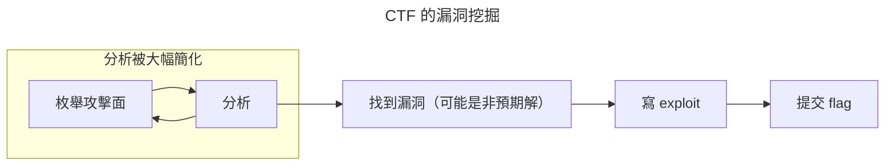
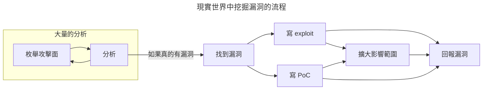
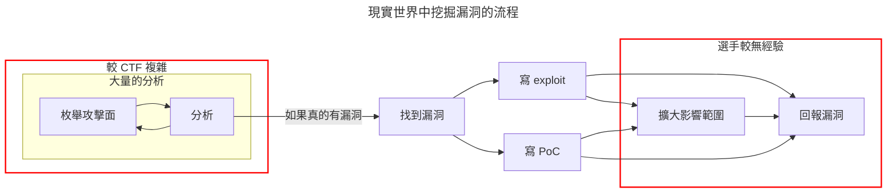

import PersistentHudNote from '../../components/PersistentHudNote.astro';

這次受邀在 HITCON 的社群活動「[HITCON CTF 揭秘](https://hitcon.kktix.cc/events/discoverctf240921)」演講，主題是「CTF 轉生－到了業界就拿出真本事」。但我偶爾還是有打打 CTF，算是「不轉生就拿出真本事」。做簡報的時候，腦袋裡面就有一堆東西飛來飛去，因此決定寫成一篇文章。

咱們就不花時間介紹 CTF 是什麼了，ddaa 寫的「[CTF 的三十道陰影](https://ithelp.ithome.com.tw/users/20121059/ironman/2810)」是最完整的系列文，除了 CTF 的介紹之外還包含了很多趣聞，非常推薦一天看一篇增廣見聞。

## 前言、碎唸、暴言

**打 CTF 有什麼好處？**

對於資訊安全感興趣的人，相信多半都參加過一兩場 CTF，也對這類活動抱有相當複雜的情感。在學習資安相關知識與技術的過程中，CTF 是一個高效且具引導性的手段。雖然它不是解決所有問題的靈丹妙藥，但在成長的初期階段，CTF 題目就像課本的習題，解題的過程一定能帶來收穫，對於剛起步的初學者來說，是一個由淺入深的學習方法。

然而，當我們想向他人推薦 CTF 或說服他人參與時，如果只是用「打 CTF 對身體好」或「打 CTF 會變聰明」這類模糊的論點，是很難令人信服的。這種說法與那些「以戰代訓對身體好」、「以戰代訓會變聰明」、「多讀簡報對身體好」或「多讀簡報會變聰明」的論述本質上沒有區別，僅僅是碰巧在對的時間點、對的情境下，給人一種正確的印象，但這並不代表提出這種說法的人真正了解它的價值。

這類論述的最大缺陷在於，宣稱的「好處」究竟是如何具體體現的？如何獲得這些好處？每個人的學習狀況與知識基礎都不同，如果不能清晰地說明具體的利弊，那這些說法往往只會流於空談和自我滿足。

一直以來也不乏有「CTF 無用」的質疑，導致一些剛起步的人無所適從，可能繞了遠路、做出低效的學習選擇，甚至只停留在某些固定的技能範疇，永遠只會那一千零一招。「CTF 無用」的背後，或許包含了像「這不實用」或「獎金太少，不如去刷 bounty」這類想法。我們需要明確地了解 CTF 能帶來的效益。當清楚這些效益後，如果認為自己已經具備相關能力，或者有更高效的方式達成目標，那麼 CTF 當然不必成為唯一的選擇。

<PersistentHudNote id="note-ransomware" note="請大家自己對號入座">除此之外，在台灣，如果曾參加像 DEFCON 決賽這樣的大型比賽，通常會在演講、授課、出題或升學等方面獲得更高的評價、酬勞與機會。也因此，近來有些 CTF 選手試圖以各種形式加入已晉級 DEFCON 決賽的隊伍，藉此提升自己的價值。然而，比賽的成績終究只是暫時的，與其過度追求短期的榮譽，不如專注於精進自己的實力，這才是健康且長遠的策略。</PersistentHudNote> 

當然，參加 CTF 的理由並不僅僅是為了這些「好處」。有時候，CTF 選手只是單純地追求快樂：解題的過程很爽、與朋友一起合作很爽、進入決賽很爽、甚至奪冠更是無與倫比的爽感。（目前還沒有台灣的隊伍在 DEFCON 決賽奪冠QQ）

這次演講的下半場主題，正是邀請研究員分享他們在業界發展中，CTF 為其帶來的助益與啟發。

## 思考暖身操

一開始我本來想說這個主題其實沒啥好講的，一個簡單的實驗就可以結束了(X)

### 1. 在心中想一到三個符合標準的出色漏洞研究員

<Image src="./think_1.png" alt="" />

為了減少「權威效應」帶來的影響，我設下一個小限制：必須具體回想起這個人實際做過的事情。例如，有些人在我心中總有個模糊的印象，覺得「他好像很懂 Windows」或「他好像很擅長滲透測試」，但當你仔細回想時，卻無法說出他到底做過什麼。後來，我把這些人看作資安圈的網紅，他們的價值大多來自於講述別人的故事以換取流量，或是透過排山倒海的專有名詞混淆聽眾來建立權威形象。說白一點，他們只是些不求甚解、散佈錯誤知識、賣弄Buzzword 的打字機罷了。

### 2. 請問他是一個好的 CTF 選手嗎？

<Image src="./think_2.png" alt="" />

目前我觀察到，近幾年的 Hacker 多數是透過 CTF 這種途徑學習成長的，當然其中也有例外，但這是比例問題。從我的體感來看，CTF 已經是資安學習中一種最有跡可循、強度足夠且成果相對可預期的方法了。

## CTF 與現實世界的差異

如前所述，在學習資安相關的知識與技術時，CTF 是一個高效又極具引導性質的手段。CTF 的設計將現實世界中漏洞挖掘過程中的許多雜訊盡可能地排除，使選手能專注於解決核心問題，相較於其他學習方式，CTF 可以快速學習並掌握關鍵技能。

接下來，我們可以通過比較 CTF 的比賽流程與現實世界的漏洞挖掘流程，來分析 CTF 能為我們帶來哪些具體的幫助。在一場 CTF 比賽中，選手針對每道題目挖掘漏洞的過程大致如下：

而在現實世界中，研究員發現資安漏洞的流程大概會是這樣：

### 差異之一： Exploit 的必要性、完整性、穩定性

在現實中，對 Exploit 的必要性及完整性要求差異較大。如果目的是向廠商回報漏洞並促使修復，通常只需要提供概念驗證（Proof of Concept, PoC），而不必提供完整的 Exploit。PoC 的目的是證明某個行為能夠觸發程式執行預期外的操作，例如：

- 意外的輸出：如訪問未經授權的資料
- 程式 Crash：例如因 Buffer Overflow 導致的 Segmentation Fault
- 不符合邏輯的動作：如繞過驗證或權限檢查。
- 執行任意指令：例如 Command Injection 導致的行為改變。

但在 CTF 比賽中，通常會要求選手從頭到尾完成漏洞挖掘與利用，並撰寫一個能夠獲得「Flag」的 Exploit。因此，CTF 中的 Exploit 對完整性的要求通常高於某些現實場景，且要求較為一致。因此大部分的 CTF 選手對於現實世界的漏洞利用都會上手的較快，尤其在面對較難利用的漏洞時，他們能憑藉比賽中累積的經驗，更容易撰寫出可行的 Exploit。

不過，在一些較為嚴苛的現實場景中，例如軍事行動、執法行動、紅隊演練或收購 Exploit 的比賽（如 Pwn2Own、kernelCTF 等），除了需要一個完整的 Exploit，Exploit 還必須具備高水準的穩定性。以紅隊演練為例，如果一個 Exploit 有可能導致目標主機當機、丟失資料或下線等影響正常營運的情況，那麼這個 Exploit 就不可能被採用。

### 差異之二：分析階段的難度、擴大影響範圍的想像力

回顧一下剛才繪製的流程圖，現實世界與 CTF 還存在幾個不同點：

首先，CTF 比賽的時間通常較短，大多為 24 到 72 小時。在這樣緊湊的時間限制下，出題方會更加專注於題目的核心概念，並不要求選手進行過多的分析。因此，當選手轉向在現實產品中挖掘漏洞時，往往會因為資料收集不完整或分析不夠深入，而錯過一些較為簡單的漏洞。

其次，CTF 比賽中的漏洞是由出題方設計的，選手只需提交 flag 就能證明漏洞的存在並完成利用。而在現實中，研究員通常需要撰寫簡單易讀的報告，完整地描述漏洞的根源、漏洞可能造成的危害、受影響的產品及版本號，並且提供重現漏洞所需的實驗環境設置，供廠商確認、評估和修復。

最後，有時候研究員發現的只是微小的瑕疵，但憑藉對計算機科學和軟體架構的深入理解，熟練的研究員往往能將多個看似不足為患的漏洞串聯起來，在現實中撕出一個巨大的缺口。

### 差異之三：到底有沒有漏洞？

或許有人已經注意到流程圖中標註的「如果真的有漏洞」這一部分。CTF 將一個概念簡化並進行包裝，選手較不會在一堆的攻擊面（Attack Surface）當中迷失自我。而且，由於選手可以「確信漏洞確實存在」，他們能夠專注於解決問題和學習題目所要傳達的核心概念。

「確信漏洞確實存在」聽起來好像沒有什麼，但無論是在 CTF 競賽中還是真實世界的漏洞挖掘過程中，當體力、精神和專注力都接近枯竭時，一個信念就能改帶來重大影響。當研究員在面對真實目標時，必須依靠知識和長期培養的直覺，堅信「這裡一定有漏洞」。（angelboy 每次都說這肯定有洞阿）

### 差異之四：現實世界的狗屎爛蛋

當然，現實世界可不是只有這一點噪音跟雜訊。實際上，研究員除了解決存在於電腦世界的難題之外，還必須解決與人之間的難題：

<Image src="./real_flow_simple.png" alt="" />

甚至結束也不是結束，後續還有各種 Happy Ending 跟 Bad Ending 等你解鎖，包括但不限於：有錢有 credit、有錢沒 credit、沒錢有 credit、沒錢沒 credit、廠商說這不是洞然後 silent fix 等等。

## CTF 帶來的幫助

### 硬技能

- 豐富的⼯具使⽤經驗：IDA、Burp Suite、Frida、流量分析工具......
    - 好的選手不僅會用工具，還會修工具，甚至自己擴展功能
- 紮實的知識：Exploit 能打成功，觀念不可能偏差的太遠 
    - CTF 鮮少有模糊空間，選手沒有辦法宣稱自己知道怎麼攻擊就拿到 flag 獲得分數，選手必須真真切切的從頭到尾不出錯的完成整個攻擊。這也強迫選手必須深入理解很多概念，這就像是看完課本之後很多人就覺得自己懂了某個概念，等到要考試時才發現原來自己漏東漏西。
- 敏銳的直覺：知道哪裡更容易出現漏洞，更容易做出 Educated Guess（通靈）

### ⼈際網路 

「研究是孤獨的」，確實，但，「在研究的當下」才是孤獨的，如果真的搞到平常一個朋友都沒有，那是真的挺可悲的。大部分人參加 CTF 比賽都不是一個人，參賽隊伍經常合併、挖角，在決賽或是實體參加的比賽現場也很容易認識外國的選手，除了單純認識之外還有可能產生更多的合作機會，例如，為了選出參加歐盟主辦的 ICC 國際賽事的亞洲區代表選手，亞洲區會員國是透過和 CTF 選手協力籌辦的 ACSC 賽事進行篩選。如果 CTF 選手經常參加各類國際比賽並且表現不錯，就有可能被邀請加入籌備團隊。

如前所述「CTF 鮮少有模糊空間，選手沒有辦法宣稱自己知道怎麼攻擊目標就拿到 flag 獲得分數，選手必須真真切切的從頭到尾不出錯的完整整個攻擊」，所以在 CTF 競賽中累積的成果是很容易被認可的。不論是在找實習或是就業上都有加分的效果。

### 軟技能 

- 資訊安全的趨勢：新的題⽬很常反映出現實的研究動態 
    - 由於每年都有一堆比賽，通常是由世界各地的選手或是研究員舉辦，很容易就可以接觸到舒適圈以外的技術或是議題。
- 快速學習：
    - CTF 比賽時間通常是 24 到 72 小時不等，在有限時間內接觸到的新概念很多，快速學習的能力就會漸漸的被培養起來。
- 合作精神：
    - 為了在比賽中獲勝，團隊的效率是很重要的。好的選手會避免與隊友做重複的事情，這也表示選手會慢慢熟悉如何將一個複雜的任務分解成若干個小任務。
- 時間管理：
    - 比賽的人力總是不足，多解出一題，名次可能就天差地遠。選手會學著去設下停損點，轉換研究⽅向 ，避免鑽牛角尖。
- 反思能力：誠實⾯對⾃⼰跟團隊的缺失、決策錯誤
    - CTF 選手通常有較高的勝負欲，每次賽後檢討都是非常的直接，久而久之，選手更能誠實⾯對⾃⼰跟團隊的不足之處。

## 如何從 CTF 銜接到實戰？

那 CTF 選手應該怎麼做才能較好的銜接到實戰呢？我們知道 CTF 選手的優勢：

- 長期累積的知識
- 對於攻擊流程的熟悉度
- 時間管理與止損點控制

而選手轉換到實戰時，遇到的挑戰是相對簡單的：

- 盡可能完整的枚舉攻擊⾯： 
    - 正確的分類攻擊⾯，每個功能具體對應到程式中的什麼部分。
- 有效率的分析： 
    - 沒有辦法把一個⽬標 100% 完整看完。需要直接切入到靠近重點的部份。
- 撰寫穩定的 Exploit： 
    - 某些情況要求 Exploit 穩定、不可讓⽬標 crash，穩定性夠⾼才有辦法投入實戰。

簡單可執行的方法是：

- 事前做好研究 
    - 過往的 CVE 以及別⼈研究的⽅法是什麼？還有機會嗎？遺漏的攻擊⾯？ 
- 事中做好筆記 
    - 在找什麼？怎麼找到這裡的？什麼東⻄分析過了？攻擊不可行的具體原因是什麼？ 
- 事後做好整理 
    - ⼀個⽬標不會只看⼀次，每次累積的經驗都是未來的優勢

### 例子

假設在研究一個 IoT 設備，為求簡化，我們假設它總共只有三個攻擊面：Web 介⾯、防火牆、處理通訊協議的 binary。圖中綠色的部份是 CP 值較高，應該優先檢查的項目；紅色部份則是 CP 值較低，耗費時間成本或難度較高的目標。

顯然，那些難度較大的項目，是個正常人都會知道自己看錯東西了，誰打個 IoT 設備會先從 iptables 開始看呢？但當難度跨距沒這麼大時，人就會往自己擅長的方向瘋狂的鑽進去。假設研究員沒有完整的枚舉攻擊面，而是在自己擅長的領域往死裡鑽，那他很有可能花了一兩個月在找某個開源 json 套件的 0day（而且最後還沒找到）。而來自世界另一端的研究員早在第一天就發現防火牆少設了一條規則，只要敲個預設密碼就可以登入主機。

當然，更常見的情況是，選手轉換到現實的研究時，常被自己在 CTF 團隊中的定位限制了思路。例如他是個 Pwner，就瘋狂往 binary 打，卻沒看到 Ｗeb 介面有一個金鑰固定的 JWT 可以被利用來直接登入 admin；是個 Web 選手，就瘋狂往 web 打，卻沒看到 binary 裡面有赤裸裸的 Command Injection。

<Image src="./attack_surface.png" alt="" />

### 練習：重現他人發現的 1-day 

CTF 的優點在於具體的題目範圍、知道絕對有漏洞存在，以及有 write-up 可以供學習參考。因此，我們可以將這些優點應用於現實世界的漏洞挖掘，為自己創造源源不絕的練習題材。具體來說，可以嘗試復現 1-day 漏洞，並在過程中挑戰以最少的資訊完成復現（通常是只看 CVE 的 advisory，卡住再參考他人的分析文章）。

為了確保「有 writeup 可以看」，建議選擇較熱門的目標，例如作業系統、瀏覽器或 IoT 設備等。同時，選定的 1-day 漏洞不可過於簡單，復現過程中至少應有一個階段具挑戰性。僅復現一個沒有難度的漏洞，例如只須輕鬆逆向就能發現的簡單 stack overflow，練習效果會有限。但如果漏洞本身簡單，分析過程卻非常困難（如軟體架構複雜或涉及硬體相關技能等），則能達到更好的效果。

## 結語

其實演講之後寫這篇文章也不是想傳遞什麼理念或是價值，只是想偷偷塞一點自己的暴言。最後要講清楚一件事情，這裡說的是「CTF 帶來的好處」，不是「只打 CTF 帶來的好處」，CTF 選手也可以會讀論文、會寫論文、會跟最新的 Conference、會做硬體攻擊，都很讚，都做。雖然大家平常搞的都是二進制，但如果連現實世界都要二分法的話那就不酷了喔。